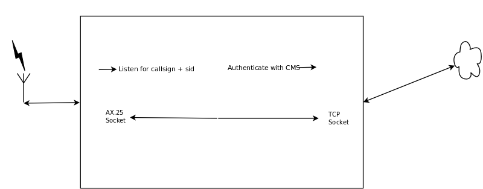

## Linux RMS Gateway
###### Basil Gunn  N7NIX,  June 2017
###### https://gitpitch.com/nwdigitalradio/rmsgw/

#HSLIDE

### History
* First entry in history file October 5, 2004

#### Authors
* Hans-J. Barthen - DL5DI
* Brian R. Eckert - W3SG

#HSLIDE

### What is Linux RMS Gateway?

* RF to Internet gateway to the Winlink 2000 ham radio email system.

#VSLIDE

#### Use Case

* RPi on all the time with dedicated radio, runs headless
  * paclink-unix used to email daily reports
  * Use ssh for config & maintenance

#VSLIDE

### Definitions

* CMS - Common Message Server
  * Provides email, telnet, bulletin & position reporting service
  * Perth, Wien, Halifax, Brentwood, San Diego
* RMS - Radio Message Server
  * Gateway from a Winlink station via radio to a CMS over the Internet

#VSLIDE

### How does it work?

* Using ax25d, Gateway listens for specific callsign & ssid (N7NIX-10)
* Gateway starts a connection between RF Client & CMS
  * Performs login "chat" & authenticates to CMS
  * Pass traffic until one end of connections goes away

#VSLIDE




#HSLIDE

### Installation

* Use a compass lite image - headless, no window manager
  * https://nwdr-compass-images.s3.amazonaws.com/image_2017-04-23-compass-lite.zip
* Use Install scripts then configure scripts
  * start here https://github.com/nwdigitalradio/n7nix
* Charles Schuman K4GBB has excellent notes & install scripts for the Raspberry Pi [here](http://k4gbb.no-ip.org/docs/raspberry.html)
  * http://k4gbb.no-ip.org/docs/raspberry.html

#VSLIDE

#### Hardware Requirements

* Radio 2M/220/440
* Raspberry Pi on 24/7
  * Can be headless
* Internet connection

#VSLIDE

#### Configuration Requirements

* Call sign
* Grid square
* Winlink password
* City, State
* Frequency ie. 145690000

#VSLIDE

#### Grid Square locator Map

* http://www.levinecentral.com/ham/grid_square.php
  * 414 N Prom, Seaside, Or. 97138
  * CN85ax

#VSLIDE

#### Configuration files in /etc/rmsgw/ directory

* channels.xml
* gateway.conf
* banner

#VSLIDE

#### Configure with script
* Core (direwolf, ax25) must be config'd first

* As root run core config from _n7nix/config_ dir
```
cd n7nix/config
./app_config.sh core
```

* As root run rmsgw config from _n7nix/config_ dir
  * then reboot
```
./app_config.sh rmsgw
shutdown -r now
```

#HSLIDE

### CMS Web Services

* CMS Web services
  * http://server.winlink.org:8085/
* Web services operations
  * http://server.winlink.org:8085/operations/metadata

#VSLIDE

#### Winlink Webservice calls - XML

* Maintain sysop XML record on Winlink
  * getsysop.py
  * mksysop.py
  * updatesysop.py

* Updates Winlink databases
  * updatechannel.py
  * updateversion.py

#VSLIDE

#### Winlink Webservice calls - RMS

* Get nearby RMS station information using cURL
  * gatewaylist.sh
  * rmslist.sh

#HSLIDE

#### Verify Install/config
##### Check core config

```
cd
cd bin
./ax25-status
```

#VSLIDE

#### Verify Install/config - con't
##### rmschanstat
```
Usage: /usr/local/bin/rmschanstat <type> <name> <call>
```
* **Note:** _call_ is case sensitive
```
rmschanstat ax25 udr0 N7NIX-10
channel udr0 with callsign N7NIX-10 on interface ax0 up
```

#VSLIDE

#### Verify Install/config - con't
##### rmsgw_aci

* Automatic check-in to Winlink using crontab
* Usage:
  * rmsgw_aci -h
  * rmsgw_aci [-c configfile] [-l logmask]
* man rmsgw_aci

```
rmsgw_aci -l debug
channel udr0 with callsign N7NIX-10 on interface ax0 up
```
#VSLIDE

#### crontab

* As root check crontab
```
crontab -u rmsgw -l
```
* Should look like this:
  * Runs automatic check-in twice an hour
```
# m h  dom mon dow   command
17,46 * * * * /usr/local/bin/rmsgw_aci > /dev/null 2>&1
```

#VSLIDE

#### Verify Install/config - con't
##### Check Winklink website

* Verify your callsign in http://winlink.org/RMSChannels
  * click on packet & zoom in to your location


#VSLIDE

#### Verify Install/config - con't
##### Log files
* Log files /var/log/rms also /var/log/rms.debug
  * log level & rotation setup in script
    * n7nix/rmsgw/config.sh
```
tail -f /var/log/rms.debug
```

#HSLIDE

### Running an RMS Gateway

* Winlink expects an RMS Gateway to run 24/7
* Check logs daily using cron, script and email
  * https://github.com/nwdigitalradio/n7nix/tree/master/debug
  * _wl2klog_install.sh_

#HSLIDE

### Where to get help
* man pages
* Forums
* Charlie Schuman K4GBB
* Google Fu

#VSLIDE

#### man pages

* cms-hosts
* getsysop.py
* mksysop.py
* rms-channels
* rms-config
* rmsgw
* rmsgw_aci
* updatesysop.py

#VSLIDE

#### Forum

* https://groups.yahoo.com/neo/groups/LinuxRMS/info

#VSLIDE

#### Internet sites

###### Charlie Schuman K4GBB

http://k4gbb.no-ip.org/docs/raspberry.html

###### NW Digital Radio

https://github.com/nwdigitalradio/rmsgw
https://github.com/nwdigitalradio/n7nix/tree/master/rmsgw

#VSLIDE

#### Google Fu

* Gene Spafford description of Usenet:

_Usenet is like a herd of performing elephants with diarrhea --
massive, difficult to redirect, awe-inspiring, entertaining, and a
source of mind-boggling amounts of excrement when you least expect
it._

#HSLIDE

#### That's it
* This presentation is a GitPitch & can be found here:

###### https://gitpitch.com/nwdigitalradio/rmsgw/

